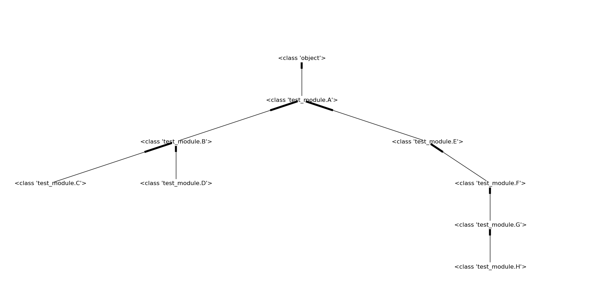

# python-inheritance-graph

Turn python modules/projects into inheritance graphs and visualize them.


```        
import test_module
inheritance_graph_maker = python_inheritance_graph.InheritanceGraphMaker()
inheritance_graph_maker.add_module(test_module)
inheritance_graph = inheritance_graph_maker.build_graph()
python_inheritance_graph.draw(inheritance_graph)
```


